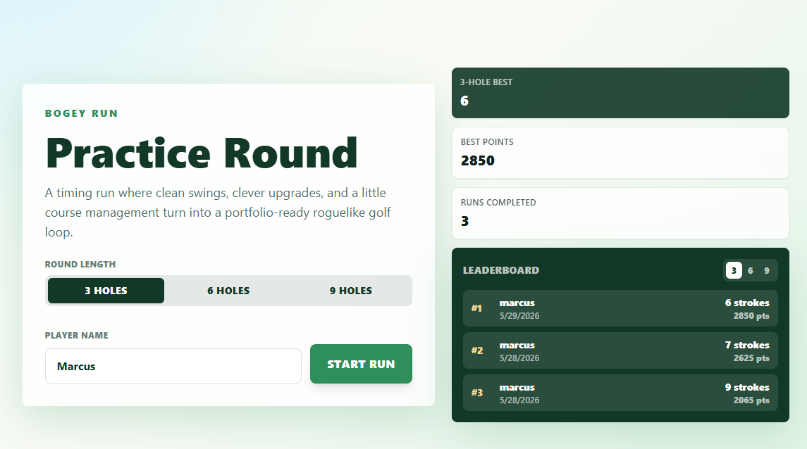
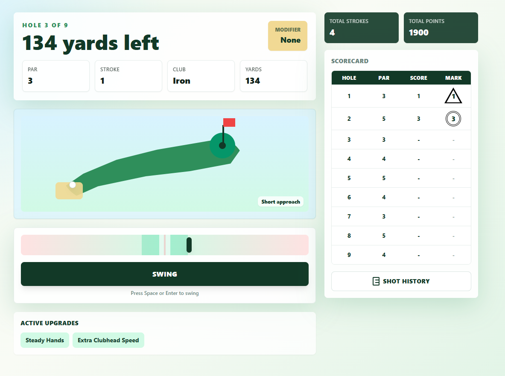
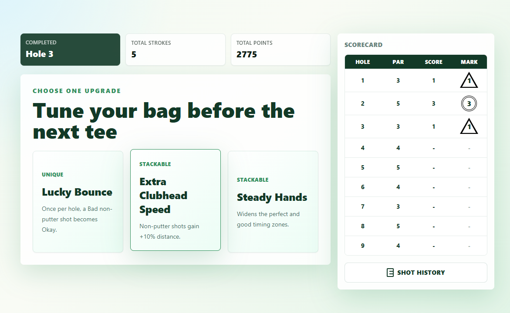

# Rogue Links: Practice Round

A browser-based roguelike golf timing game built with Next.js, React, TypeScript, Tailwind CSS, and Zustand.

Rogue Links turns a simple swing-meter mechanic into a replayable golf loop: players choose a round length, play randomized balanced courses, earn upgrades between holes, and compete against per-format leaderboards.

## Playable Demo

[Play Rogue Links](https://msakoda.github.io/react-golf/)

## Screenshots

### Home Screen



### Gameplay



### Upgrade Selection



## Project Impact

- Built a complete interactive game loop with stateful screens, animation flow, scoring, upgrades, persistence, and replayability.
- Designed a typed game domain model in TypeScript for holes, shots, upgrades, records, leaderboards, and round lengths.
- Implemented balanced procedural course generation so every 3-, 6-, or 9-hole round has equal par 3, par 4, and par 5 distribution.
- Added persistent local records with per-round-length leaderboard tabs, so scores remain fair across different game formats.
- Refactored state concerns into focused modules for scoring, record persistence, logging, and game utilities.
- Delivered responsive UI using reusable components for stat cards, scorecards, confirmations, swing controls, and course visualization.

## Gameplay Features

- Choose between 3-hole, 6-hole, and 9-hole rounds.
- Play randomized courses with varied yardages and hole order each run.
- Use timing-based swings with quality outcomes: Perfect, Good, Okay, and Bad.
- Earn points from shot quality and hole results.
- Choose upgrades between holes, including stackable effects.
- View active upgrades with grouped stack counts, such as `Steady Hands x2`.
- Track score through a full scorecard with total strokes and relation to par.
- Compare results on leaderboard tabs for each round length.
- Persist player name, best scores, best points, completed runs, and leaderboard entries in local storage.

## Technical Highlights

- **Framework:** Next.js App Router
- **Language:** TypeScript
- **UI:** React and Tailwind CSS
- **State Management:** Zustand
- **Persistence:** Browser `localStorage`
- **Architecture:** Domain-specific helpers separated from store orchestration

Key modules:

- `src/stores/gameStore.ts` coordinates game state and screen transitions.
- `src/lib/game/utils.ts` contains course generation, swing quality, upgrade logic, and shot resolution.
- `src/lib/game/records.ts` handles saved records and leaderboard persistence.
- `src/lib/game/scoring.ts` handles score labels.
- `src/lib/game/types.ts` defines the game domain model.

## Running Locally

Install dependencies:

```bash
npm install
```

Start the development server:

```bash
npm run dev
```

Build for production:

```bash
npm run build
```

Start the production server:

```bash
npm start
```

## Why This Project Matters

Rogue Links is intentionally small in scope but complete in execution. It shows product thinking, frontend polish, state modeling, typed data design, and iterative refactoring inside a playable experience. The result is not just a UI demo, but a functioning interactive system with meaningful rules, persistent progress, and replay value.
