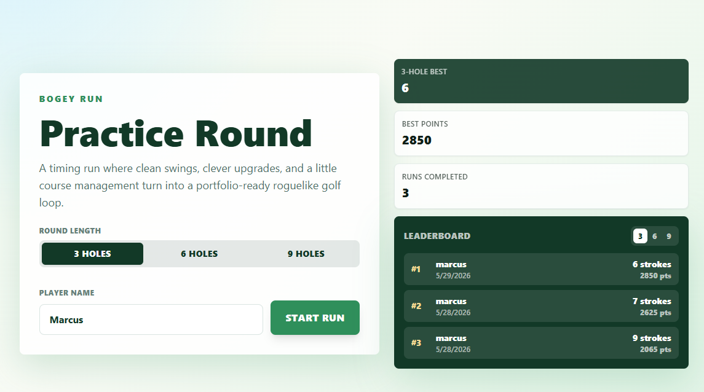
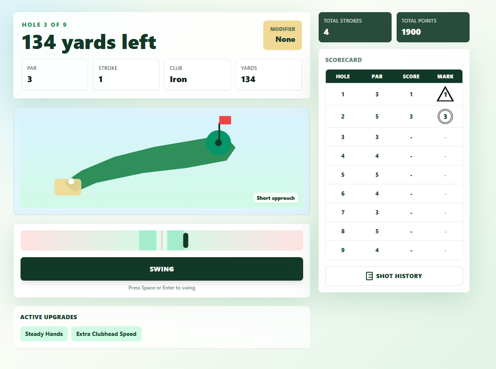
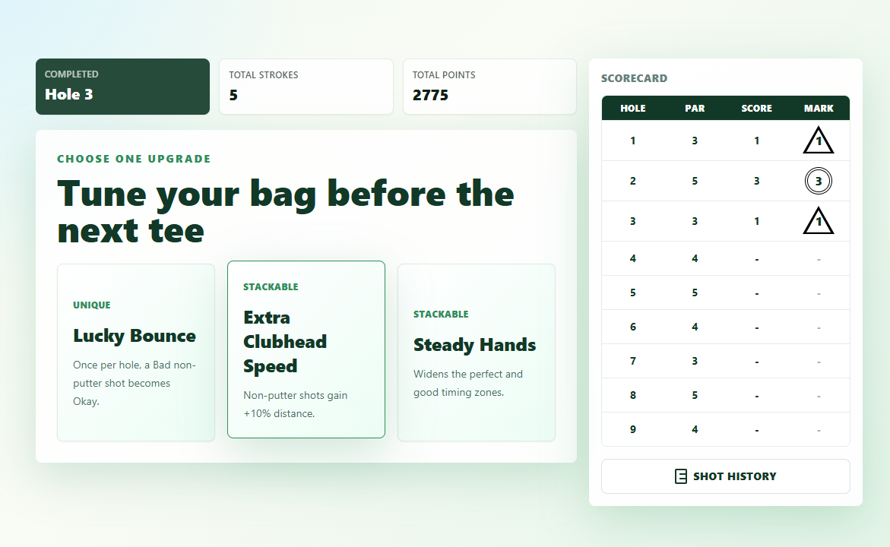

# Rogue Links: Practice Round

[](https://github.com/MSakoda/react-golf/actions/workflows/ci.yml)

A browser-based roguelike golf timing game built with Next.js, React, TypeScript, Tailwind CSS, and Zustand.

Rogue Links turns a simple swing-meter mechanic into a replayable golf loop: players choose a round length, play randomized balanced courses, earn upgrades between holes, and compete against per-format leaderboards.

## Playable Demo

[Play Rogue Links](https://msakoda.github.io/react-golf/)

## Screenshots

### Home Screen



### Gameplay



### Upgrade Selection



## Project Impact

- Built a complete interactive game loop with stateful screens, animation flow, scoring, upgrades, persistence, and replayability.
- Designed a typed game domain model in TypeScript for holes, shots, upgrades, records, leaderboards, and round lengths.
- Implemented balanced procedural course generation so every 3-, 6-, or 9-hole round has equal par 3, par 4, and par 5 distribution.
- Added persistent local records with per-round-length leaderboard tabs, so scores remain fair across different game formats.
- Refactored state concerns into focused modules for scoring, record persistence, logging, and game utilities.
- Delivered responsive UI using reusable components for stat cards, scorecards, confirmations, swing controls, and course visualization.

## Gameplay Features

- Choose between 3-hole, 6-hole, and 9-hole rounds.
- Play randomized courses with varied yardages and hole order each run.
- Use timing-based swings with quality outcomes: Perfect, Good, Okay, and Bad.
- Earn points from shot quality and hole results.
- Choose upgrades between holes, including stackable effects.
- View active upgrades with grouped stack counts, such as `Steady Hands x2`.
- Track score through a full scorecard with total strokes and relation to par.
- Compare results on leaderboard tabs for each round length.
- Persist player name, best scores, best points, completed runs, and leaderboard entries in local storage.

## Technical Highlights

- **Framework:** Next.js App Router
- **Language:** TypeScript
- **UI:** React and Tailwind CSS
- **State Management:** Zustand
- **Persistence:** Browser `localStorage`
- **Architecture:** Domain-specific helpers separated from store orchestration

Key modules:

- `src/stores/gameStore.ts` coordinates game state and screen transitions.
- `src/lib/game/utils.ts` contains course generation, swing quality, upgrade logic, and shot resolution.
- `src/lib/game/records.ts` handles saved records and leaderboard persistence.
- `src/lib/game/scoring.ts` handles score labels.
- `src/lib/game/types.ts` defines the game domain model.

## Running Locally

Install dependencies:

```bash
npm install
```

Start the development server:

```bash
npm run dev
```

Build for production:

```bash
npm run build
```

Start the production server:

```bash
npm start
```

## Testing

```bash
npm run typecheck   # tsc --noEmit
npm run lint        # next lint
npm test            # Vitest unit and component tests
npm run test:e2e    # Playwright end-to-end and accessibility (builds and serves the app on port 3100)
```

CI runs all four on every push (`.github/workflows/ci.yml`).

**What is tested**

- **Game rules** (`src/lib/game/*.test.ts`): club selection, swing-quality thresholds, upgrade effects and stacking, shot resolution (carry, wind, overshoot, putting, Lucky Bounce), hole scoring, leaderboard ordering, and reading saved records, including corrupt and legacy data. Tests use hand-worked numbers at the boundaries rather than restating the formulas.
- **Game flow** (`src/stores/gameStore.test.ts`): the Zustand store from starting a run through shots, hole results, upgrade picks and run completion, including record keeping and what persists.
- **Components**: the swing meter (fake timers for its animation loop, keyboard and button input, freezing after a swing, cleanup on unmount) and the result dialog.
- **End to end** (`e2e/round.spec.ts`): starting a run, a swing locking the meter and raising the result dialog, a full 3-hole round posting to the leaderboard and surviving a reload, and choosing a longer round.
- **Accessibility** (`e2e/accessibility.spec.ts`): axe-core finds zero violations on the home, hole, result dialog, upgrade and run-complete screens, plus the home, hole and dialog screens at a 412px mobile width.

**What is not tested, and why**

- **Randomness is not seeded.** The game calls `Math.random` directly, so hole generation and upgrade choices are checked by properties (counts, ranges, uniqueness) over repeated runs, not by exact output. The end-to-end rounds use whatever swings and scores come up, so they assert the shape of a round, not exact scores.
- **No visual or pixel checks.** The fairway view and ball animation are exercised by the end-to-end flow but not inspected.
- **axe only covers what it can detect.** It does not replace testing with a screen reader, and it cannot check keyboard focus order. The confirmation dialog does not move focus into itself on open; it is reachable by Space/Enter, but that is not asserted.
- **Single light theme, Chromium only.** There is no dark theme, and Playwright runs Chromium alone.
- **`HomeScreen`, `HoleScreen`, `UpgradeScreen` and `RunCompleteScreen` have no component tests of their own**; the end-to-end flow is their coverage.

Tests were checked to be able to fail: for 20 deliberate breakages (for example removing the swing guard, the Lucky Bounce once-per-hole check, the saved-records write, or reverting the button colour) at least one test turned red. One weak test found this way (it never owned a stackable upgrade) was fixed.

**Accessibility fixes made when the gate was added.** The first axe run flagged colour contrast only: white text on the `fairway` green was 4.03:1 and the "Modifier" label on the sand tile was 3.77:1 (both under the 4.5:1 minimum). The green was darkened from `#2f8f5b` to `#267a4e` (5.28:1 on white) and the label opacity raised from 60% to 80%.

## Why This Project Matters

Rogue Links is intentionally small in scope but complete in execution. It shows product thinking, frontend polish, state modeling, typed data design, and iterative refactoring inside a playable experience. The result is not just a UI demo, but a functioning interactive system with meaningful rules, persistent progress, and replay value.
